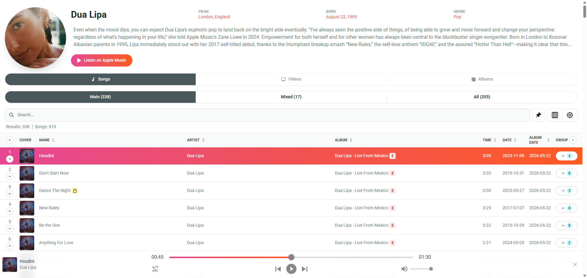

### https://apple-music-artist-browser.vercel.app

#  Artist Browser

Artist Browser is a web application built for music enthusiasts who want to explore an artist's complete catalog available on Apple Music and in the iTunes Store.

Unlike the official Apple Music app, which only displays a limited selection of Top Songs, Artist Browser lets you explore **every available track** by an artist. All songs are presented in a customizable table where you can sort and filter tracks to quickly find specific releases or songs. You can also listen to song previews and view detailed release information.



## 🧰 Installation (Run locally)

1. Install [Node.js](https://nodejs.org/en) and [Git](https://git-scm.com/)

2. Clone the repository:

   ```bash
   git clone https://github.com/pawllo01/apple-music-artist-browser.git
   ```

3. Install dependencies in the project directory:

   ```bash
   npm install --prefix ./backend
   npm install --prefix ./app
   ```

4. Create `.env` files in both directories and add the required environment variables:

   **backend/.env**

   ```env
   PORT=3000
   API_TOKEN=YOUR_APPLE_MUSIC_API_TOKEN
   ```

   **app/.env**

   ```env
   VITE_API_URL=http://localhost:3000
   ```

5. Run the app

   Option 1 - Quick Launch (Windows)
   - Use the included `START.bat` script for a quick launch.
   - To stop the app, simply close both cmd.exe windows.

   Option 2 - Manual Start (Recommended for developers)
   - You can start each service manually:

     ```bash
     npm run dev --prefix ./backend
     npm run dev --prefix ./app
     ```

6. App runs on http://localhost:5173/
